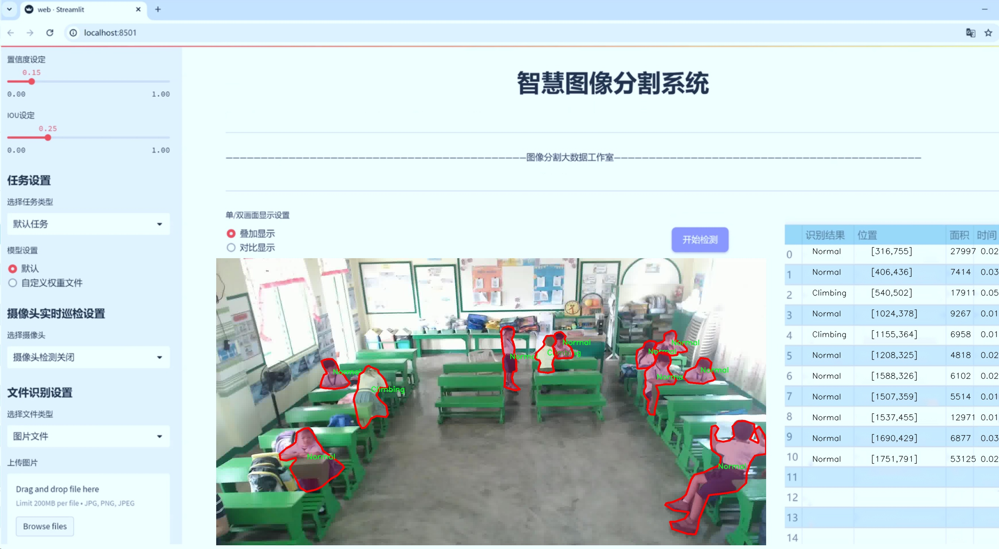
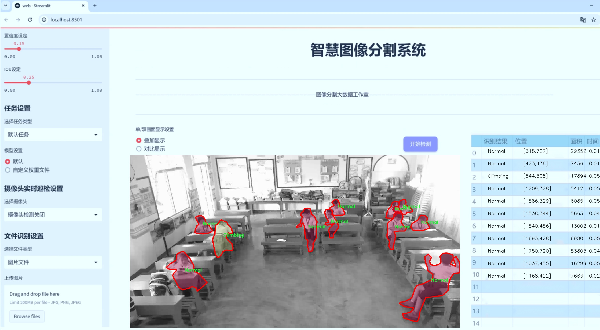
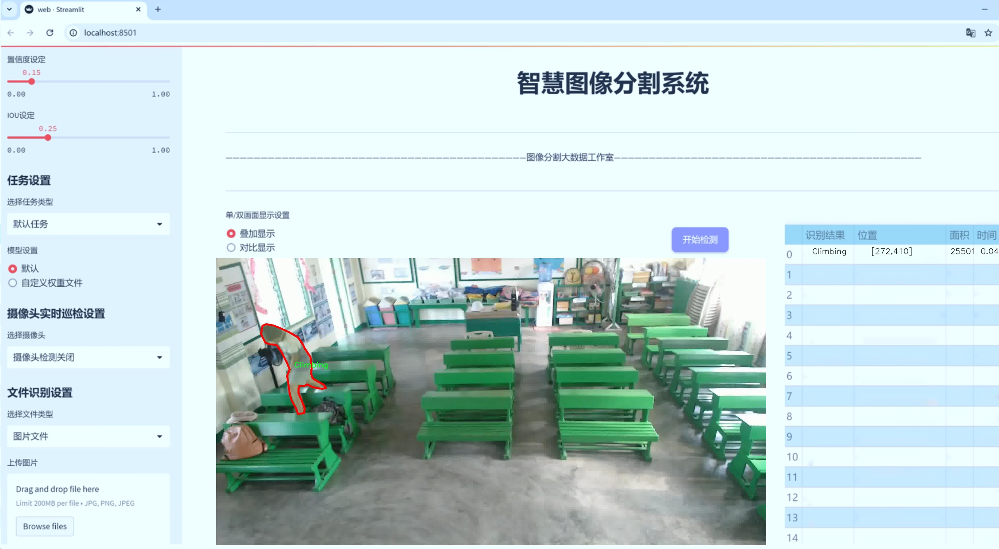
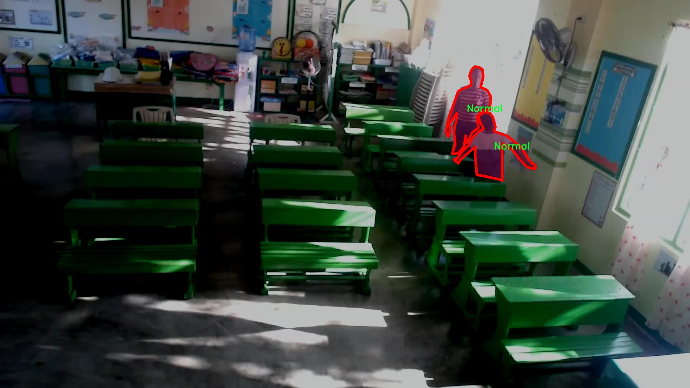
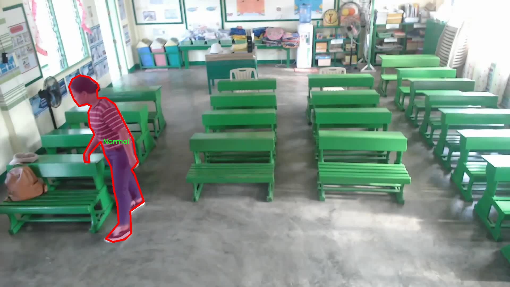
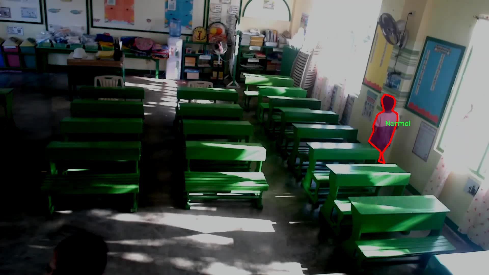
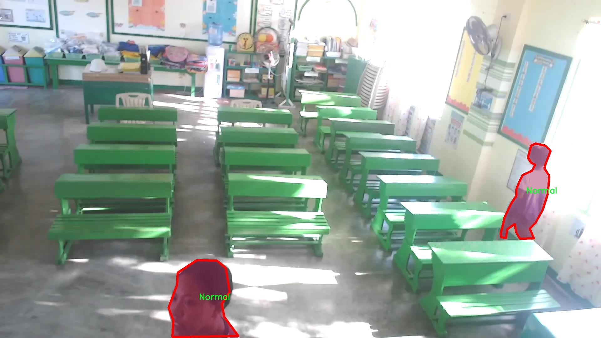

# 课堂安全隐患检测系统： yolov8-seg-C2f-FocusedLinearAttention

### 1.研究背景与意义

[参考博客](https://gitee.com/YOLOv8_YOLOv11_Segmentation_Studio/projects)

[博客来源](https://kdocs.cn/l/cszuIiCKVNis)

研究背景与意义

随着教育事业的不断发展，课堂环境的安全问题日益受到重视。课堂不仅是学生获取知识的场所，更是他们身心发展的重要空间。然而，课堂安全隐患的存在，可能会对学生的学习和生活造成严重影响。因此，构建一个高效的课堂安全隐患检测系统显得尤为重要。近年来，计算机视觉技术的快速发展为安全隐患的自动检测提供了新的可能性。尤其是基于深度学习的目标检测算法，如YOLO（You Only Look Once），因其高效性和准确性而被广泛应用于各种场景的实时监测。

在此背景下，本文提出了一种基于改进YOLOv8的课堂安全隐患检测系统。YOLOv8作为YOLO系列的最新版本，具备更强的特征提取能力和更快的推理速度，能够在复杂的课堂环境中实时识别和定位潜在的安全隐患。通过对YOLOv8的改进，我们可以更好地适应课堂环境的特殊性，提升模型在不同安全隐患类别下的检测性能。

本研究所使用的数据集包含1700张图像，涵盖了四个主要类别：攀爬、正常、奔跑和篡改。这些类别不仅反映了课堂环境中可能出现的多种行为模式，也为模型的训练和评估提供了丰富的样本。攀爬行为可能指学生在课堂内外不当使用设施，奔跑行为则可能导致意外碰撞，而篡改行为则涉及对课堂设备或材料的不当操作。这些行为的及时检测，对于预防事故的发生、维护课堂秩序具有重要意义。

此外，随着教育信息化的推进，课堂安全隐患的监测逐渐向智能化、自动化发展。传统的人工监测方式不仅效率低下，而且容易受到主观因素的影响。基于改进YOLOv8的检测系统，能够实现对课堂安全隐患的实时监控和自动报警，极大地提升了安全管理的效率和准确性。通过引入智能监测系统，学校可以更好地保障学生的安全，营造一个良好的学习环境。

综上所述，基于改进YOLOv8的课堂安全隐患检测系统的研究，不仅具有重要的理论意义，还具有广泛的应用前景。通过对课堂安全隐患的自动检测和识别，能够有效降低安全事故的发生率，提高课堂管理的智能化水平。这一研究将为教育领域的安全管理提供新的思路和方法，推动课堂安全管理的科学化和现代化进程。同时，随着研究的深入，改进的YOLOv8模型也将为其他领域的安全隐患检测提供借鉴，具有较高的推广价值。

### 2.图片演示







注意：本项目提供完整的训练源码数据集和训练教程,由于此博客编辑较早,暂不提供权重文件（best.pt）,需要按照6.训练教程进行训练后实现上图效果。

### 3.视频演示

[3.1 视频演示](https://www.bilibili.com/video/BV1jbzFYaEcd/)

### 4.数据集信息

##### 4.1 数据集类别数＆类别名

nc: 4
names: ['Climbing', 'Normal', 'Running', 'Tampering']


##### 4.2 数据集信息简介

数据集信息展示

在当前教育环境中，课堂安全隐患的检测与预防显得尤为重要。为此，我们构建了一个名为“Hazard Detection in Classroom”的数据集，旨在为改进YOLOv8-seg模型提供丰富的训练数据。该数据集专注于识别和分类课堂内可能存在的安全隐患，涵盖了四个主要类别，分别是“Climbing”（攀爬）、“Normal”（正常）、“Running”（奔跑）和“Tampering”（干扰）。这些类别的选择不仅反映了课堂环境中常见的行为模式，也为安全隐患的识别提供了多维度的视角。

在数据集的构建过程中，我们通过多种途径收集了大量的图像和视频数据。这些数据来自于不同类型的课堂场景，包括传统教室、实验室和多媒体教室等，确保了数据的多样性和代表性。每个类别的样本均经过精心标注，以确保模型在训练过程中能够准确学习到各类行为的特征。例如，“Climbing”类别的样本主要包括学生在教室内攀爬桌椅或其他设施的情景，这类行为可能导致意外事故，因此需要特别关注。“Normal”类别则涵盖了学生在课堂上正常上课的情景，作为对比数据，有助于模型识别何为安全的课堂行为。

“Running”类别则记录了学生在教室内奔跑的情况，这种行为虽然在某些情况下是正常的，但在特定环境下也可能引发安全隐患，尤其是在狭小的空间内。因此，准确识别这一行为对于课堂安全管理至关重要。而“Tampering”类别则专注于识别学生对课堂设备或材料的干扰行为，这种行为可能会导致设备损坏或安全隐患的增加，因此同样需要引起重视。

为了确保数据集的有效性和实用性，我们在数据采集过程中采用了多种数据增强技术，包括图像旋转、缩放、裁剪和颜色调整等。这些技术不仅增加了数据集的样本数量，还提高了模型的鲁棒性，使其能够在不同的光照、角度和背景下保持良好的识别性能。此外，数据集还经过严格的质量控制，确保每个标注的准确性和一致性，从而为后续的模型训练提供可靠的基础。

通过使用“Hazard Detection in Classroom”数据集，我们期望能够显著提升YOLOv8-seg模型在课堂安全隐患检测方面的性能。该数据集的多样性和丰富性将为模型提供充足的学习素材，使其能够更好地适应复杂的课堂环境，及时识别潜在的安全隐患，从而为学生和教师提供一个更加安全的学习空间。随着技术的不断进步，我们相信，通过对这一数据集的深入研究和应用，能够为课堂安全管理提供更加智能化和自动化的解决方案。










### 5.项目依赖环境部署教程（零基础手把手教学）

[5.1 环境部署教程链接（零基础手把手教学）](https://www.bilibili.com/video/BV1jG4Ve4E9t/?vd_source=bc9aec86d164b67a7004b996143742dc)


[5.2 安装Python虚拟环境创建和依赖库安装视频教程链接（零基础手把手教学）](https://www.bilibili.com/video/BV1nA4VeYEze/?vd_source=bc9aec86d164b67a7004b996143742dc)

### 6.手把手YOLOV8-seg训练视频教程（零基础手把手教学）

[6.1 手把手YOLOV8-seg训练视频教程（零基础小白有手就能学会）](https://www.bilibili.com/video/BV1cA4VeYETe/?vd_source=bc9aec86d164b67a7004b996143742dc)


按照上面的训练视频教程链接加载项目提供的数据集，运行train.py即可开始训练



     Epoch   gpu_mem       box       obj       cls    labels  img_size
     1/200     0G   0.01576   0.01955  0.007536        22      1280: 100%|██████████| 849/849 [14:42<00:00,  1.04s/it]
               Class     Images     Labels          P          R     mAP@.5 mAP@.5:.95: 100%|██████████| 213/213 [01:14<00:00,  2.87it/s]
                 all       3395      17314      0.994      0.957      0.0957      0.0843

     Epoch   gpu_mem       box       obj       cls    labels  img_size
     2/200     0G   0.01578   0.01923  0.007006        22      1280: 100%|██████████| 849/849 [14:44<00:00,  1.04s/it]
               Class     Images     Labels          P          R     mAP@.5 mAP@.5:.95: 100%|██████████| 213/213 [01:12<00:00,  2.95it/s]
                 all       3395      17314      0.996      0.956      0.0957      0.0845

     Epoch   gpu_mem       box       obj       cls    labels  img_size
     3/200     0G   0.01561    0.0191  0.006895        27      1280: 100%|██████████| 849/849 [10:56<00:00,  1.29it/s]
               Class     Images     Labels          P          R     mAP@.5 mAP@.5:.95: 100%|███████   | 187/213 [00:52<00:00,  4.04it/s]
                 all       3395      17314      0.996      0.957      0.0957      0.0845


### 7.50+种全套YOLOV8-seg创新点加载调参实验视频教程（一键加载写好的改进模型的配置文件）

[7.1 50+种全套YOLOV8-seg创新点加载调参实验视频教程（一键加载写好的改进模型的配置文件）](https://www.bilibili.com/video/BV1Hw4VePEXv/?vd_source=bc9aec86d164b67a7004b996143742dc)

### YOLOV8-seg算法简介

原始YOLOV8-seg算法原理

YOLO（You Only Look Once）系列算法自其诞生以来便以其高效的目标检测能力而受到广泛关注。随着深度学习技术的不断进步，YOLO系列也在不断演化，最新的YOLOv8-seg算法则在此基础上进行了进一步的优化与创新。YOLOv8-seg不仅继承了YOLO系列的优良特性，还在模型结构、特征提取和损失计算等多个方面进行了显著改进，旨在实现更高效、更准确的目标检测与分割任务。

YOLOv8-seg算法的核心在于其独特的网络结构设计，主要由输入端、主干网络和检测端三部分组成。与之前的YOLO版本相比，YOLOv8-seg引入了C2f模块，这一模块结合了C3模块和ELAN模块的优点，增加了更多的残差连接，使得模型在保持轻量化的同时，能够获得更丰富的梯度信息。这种设计不仅提升了特征提取的效率，还增强了模型的表达能力，从而使得YOLOv8-seg在复杂场景下的目标检测表现得更加出色。

在主干网络部分，YOLOv8-seg采用了一系列卷积和反卷积层来提取特征。通过使用C2模块作为基本构成单元，网络能够在不同的层次上捕捉到丰富的特征信息。此外，主干网络中还引入了快速空间金字塔池化（SPPF）模块，进一步提升了特征提取的多样性和灵活性。SPPF模块的设计使得网络能够在不同尺度上进行特征融合，从而更好地适应不同尺寸的目标。

YOLOv8-seg在特征融合层的设计上也做出了创新。该算法结合了特征金字塔网络（FPN）和路径聚合网络（PAN），实现了多尺度特征的高效融合。通过在特征融合网络中引入BiFPN结构，YOLOv8-seg能够在不同尺度特征之间进行双向连接和加权融合，这一设计极大地提高了模型对不同尺度特征信息的提取速度和准确性。BiFPN的引入使得YOLOv8-seg在处理复杂场景时，能够更好地捕捉到目标的细节信息，从而提升了检测的鲁棒性。

在检测端，YOLOv8-seg采用了解耦合头结构，将分类和检测任务分开处理，这一设计使得模型在处理目标检测时更加灵活和高效。与传统的Anchor-Based方法不同，YOLOv8-seg采用了Anchor-Free的策略，这一转变不仅简化了模型的设计，还提高了目标检测的准确性。此外，检测头中使用的轻量化结构进一步减少了计算开销，使得YOLOv8-seg在实时检测任务中表现得更加出色。

为了提高模型的训练效果，YOLOv8-seg在数据增强方面也进行了创新。通过在训练的最后10个epoch中关闭马赛克增强，并采用动态的Task-Aligned Assigner样本分配策略，YOLOv8-seg能够更好地适应不同的训练任务，从而提升模型的泛化能力。这一策略的引入，使得模型在面对多样化的输入数据时，能够保持较高的检测精度。

在损失计算方面，YOLOv8-seg采用了BCELoss作为分类损失，DFLLoss和CIoULoss作为回归损失。这一组合的损失函数设计，旨在更好地平衡分类和回归任务的训练，使得模型在优化过程中能够兼顾目标的定位和分类信息，从而提升整体的检测性能。

综上所述，YOLOv8-seg算法通过在网络结构、特征提取、损失计算等多个方面的创新与优化，展现了其在目标检测与分割任务中的强大能力。其轻量化设计和高效的特征融合策略，使得YOLOv8-seg不仅适用于实时检测任务，也能够在复杂场景中保持良好的性能表现。随着YOLOv8-seg的不断发展与应用，未来的目标检测技术将更加智能、高效，为各类应用场景提供更为精准的解决方案。


### 9.系统功能展示（检测对象为举例，实际内容以本项目数据集为准）

图9.1.系统支持检测结果表格显示

  图9.2.系统支持置信度和IOU阈值手动调节

  图9.3.系统支持自定义加载权重文件best.pt(需要你通过步骤5中训练获得)

  图9.4.系统支持摄像头实时识别

  图9.5.系统支持图片识别

  图9.6.系统支持视频识别

  图9.7.系统支持识别结果文件自动保存

  图9.8.系统支持Excel导出检测结果数据


### 10.50+种全套YOLOV8-seg创新点原理讲解（非科班也可以轻松写刊发刊，V11版本正在科研待更新）

#### 10.1 由于篇幅限制，每个创新点的具体原理讲解就不一一展开，具体见下列网址中的创新点对应子项目的技术原理博客网址【Blog】：


[10.1 50+种全套YOLOV8-seg创新点原理讲解链接](https://gitee.com/qunmasj/good)

#### 10.2 部分改进模块原理讲解(完整的改进原理见上图和技术博客链接)【如果此小节的图加载失败可以通过CSDN或者Github搜索该博客的标题访问原始博客，原始博客图片显示正常】
### YOLOv8简介
目前YOLO系列的SOTA模型是ultralytics公司于2023年发布的YOLOv8.按照模型宽度和深度不同分为YOLOv8n、YOLOv8s、YOLOv8m、YOLOv81、YOLOv8x五个版本。本文改进的是 YOLOv8n模型。
YOLOv8的 Backbone采用CSPDarknet结构，它是 Darknet 的一种改进，引入CSP改善网络结构。CSPDarknet把特征图分为两部分，一部分进行卷积操作，另一部分进行跳跃连接，在保持网络深度的同时减少参数量和计算量，提高网络效率。Neck 部分采用特征金字塔PANet[17]，通过自顶向下路径结合和自底向上特征传播进行多尺度融合。损失函数采用了CIloU[18]。YOLOv8的网络结构如图所示。


### ParC融合位置感知循环卷积简介
ParC：Position aware circular convolution


#### Position aware circular convolution
针对于全局信息的提取作者提出了Position aware circular convolution（也称作Global Circular Convolution）。图中左右实际是对于该操作水平竖直两方向的对称，理解时只看左边即可。对于维度为C*H*W的输入，作者先将维度为C*B*1的Position Embedding通过双线性插值函数F调整到适合input的维度C*H*1（以适应不同特征大小输入），并且将PE水平复制扩展到C*H*W维度与输入特征相加。这里作者将PE直接设置成为了可学习的参数。

接下来参考该博客将加入PE的特征图竖直方向堆叠，并且同样以插值的方式得到了适应输入维度的C*H*1大小的卷积核，进行卷积操作。对于这一步卷积，作者将之称为循环卷积，并给出了一个卷积示意图。


但个人感觉实际上这个示意图只是为了说明为什么叫循环卷积，对于具体的计算细节还是根据公式理解更好。


进一步，作者给出了这一步的伪代码来便于读者对这一卷积的理解：y=F.conv2D（torch.cat（xp，xp，dim=2），kV），实际上就是将xp堆叠之后使用了一个“条形（或柱形）”卷积核进行简单的卷积操作。（但这样会导致多一次重复卷积，因此在堆叠示意图中只取了前2*H-1行）

可以看到在示意图中特征维度变化如下：C*(2H-1)*W ---C*H*1--->C*H*W，作者特意带上了通道数，并且并没有出现通道数的改变，那么这里所进行的卷积应该是depth wise卷积，通过对文章后续以及论文源码的阅读可以得知这一步进行的就是DW卷积。（we introduce group convolution and point wise convolution into these modules, which decreases number of parameters without hurting performance.）


由groups = channel可知使用的是DW卷积
通过上面就完成了一次竖直方向的全局信息交流，同样只要在水平方向进行同样的操作即可做到水平方向的全局信息交流。

#### ParC block

通过ParC成功解决了全局信息提取的问题，接下来就是针对2）3）两点进行改进。首先是Meta-Former模块，Meta-Former由Token Mixer和Channel Mixer构成，ParC首先满足了Token Mixer的全局信息提取的要求，并且相较于Attention在计算成本上更低。


这里①中的PWC即point wise conv，进一步验证了我们前面对于深度可分离卷积的想法，而GCC-H/V即是前面所说的ParC-H/V。

①构建了Meta-Former中的Token mixer模块，那么最后剩下的问题就是3），替换掉Attention模块之后模型不再data driven。为了解决这一点作者给出了一个channel wise attention，先将特征图（x,C*H*W）进行global average（a,C*1*1）并输入一个MLP生成一个channel wise的权重（w,C*1*1），再将权重与特征图在通道方向相乘得到输出（output = wx,C*H*W）。

#### ParC net
对于ParC net 的搭建，作者直接基于MobileViT，采用了分叉结构（c）完成了网络的搭建。


具体而言作者保留了MobileViT中浅层具有局部感受野的MobileNetV2结构，而将网络深层的ViT block替换成了ParC block，使网络变成了一个pure ConvNet。


### 11.项目核心源码讲解（再也不用担心看不懂代码逻辑）

#### 11.1 ultralytics\solutions\ai_gym.py

以下是对代码的核心部分进行提炼和详细注释的结果：

```python
import cv2
from ultralytics.utils.plotting import Annotator

class AIGym:
    """管理实时视频流中人们的健身动作计数的类。"""

    def __init__(self):
        """初始化 AIGym，设置视觉和图像参数的默认值。"""
        self.im0 = None  # 当前帧图像
        self.tf = None   # 线条厚度
        self.keypoints = None  # 关键点数据
        self.poseup_angle = None  # 动作上升角度阈值
        self.posedown_angle = None  # 动作下降角度阈值
        self.threshold = 0.001  # 阈值（未使用）
        self.angle = None  # 角度信息
        self.count = None  # 动作计数
        self.stage = None  # 当前动作阶段
        self.pose_type = 'pushup'  # 动作类型（默认是俯卧撑）
        self.kpts_to_check = None  # 需要检查的关键点
        self.view_img = False  # 是否显示图像
        self.annotator = None  # 注释器对象

    def set_args(self, kpts_to_check, line_thickness=2, view_img=False, pose_up_angle=145.0, pose_down_angle=90.0, pose_type='pullup'):
        """
        配置 AIGym 的参数。
        Args:
            kpts_to_check (list): 用于计数的 3 个关键点
            line_thickness (int): 边界框的线条厚度
            view_img (bool): 是否显示图像
            pose_up_angle (float): 动作上升时的角度
            pose_down_angle (float): 动作下降时的角度
            pose_type (str): 动作类型 ("pushup", "pullup" 或 "abworkout")
        """
        self.kpts_to_check = kpts_to_check  # 设置需要检查的关键点
        self.tf = line_thickness  # 设置线条厚度
        self.view_img = view_img  # 设置是否显示图像
        self.poseup_angle = pose_up_angle  # 设置上升角度阈值
        self.posedown_angle = pose_down_angle  # 设置下降角度阈值
        self.pose_type = pose_type  # 设置动作类型

    def start_counting(self, im0, results, frame_count):
        """
        计数健身动作的函数。
        Args:
            im0 (ndarray): 当前视频流的帧图像
            results: 姿态估计数据
            frame_count: 当前帧计数
        """
        self.im0 = im0  # 保存当前帧图像
        if frame_count == 1:
            # 初始化计数、角度和阶段
            self.count = [0] * len(results[0])
            self.angle = [0] * len(results[0])
            self.stage = ['-' for _ in results[0]]
        
        self.keypoints = results[0].keypoints.data  # 获取关键点数据
        self.annotator = Annotator(im0, line_width=2)  # 创建注释器

        # 遍历每个关键点
        for ind, k in enumerate(reversed(self.keypoints)):
            # 计算角度并更新计数和阶段
            self.angle[ind] = self.annotator.estimate_pose_angle(
                k[int(self.kpts_to_check[0])].cpu(),
                k[int(self.kpts_to_check[1])].cpu(),
                k[int(self.kpts_to_check[2])].cpu()
            )
            self.im0 = self.annotator.draw_specific_points(k, self.kpts_to_check, shape=(640, 640), radius=10)

            # 根据动作类型更新阶段和计数
            if self.pose_type == 'pushup':
                if self.angle[ind] > self.poseup_angle:
                    self.stage[ind] = 'up'
                if self.angle[ind] < self.posedown_angle and self.stage[ind] == 'up':
                    self.stage[ind] = 'down'
                    self.count[ind] += 1
            
            elif self.pose_type == 'pullup':
                if self.angle[ind] > self.poseup_angle:
                    self.stage[ind] = 'down'
                if self.angle[ind] < self.posedown_angle and self.stage[ind] == 'down':
                    self.stage[ind] = 'up'
                    self.count[ind] += 1
            
            # 绘制角度、计数和阶段信息
            self.annotator.plot_angle_and_count_and_stage(
                angle_text=self.angle[ind],
                count_text=self.count[ind],
                stage_text=self.stage[ind],
                center_kpt=k[int(self.kpts_to_check[1])],
                line_thickness=self.tf
            )

            # 绘制关键点
            self.annotator.kpts(k, shape=(640, 640), radius=1, kpt_line=True)

        # 如果需要显示图像，则进行显示
        if self.view_img:
            cv2.imshow('Ultralytics YOLOv8 AI GYM', self.im0)
            if cv2.waitKey(1) & 0xFF == ord('q'):
                return

if __name__ == '__main__':
    AIGym()  # 创建 AIGym 实例
```

### 代码核心部分说明：
1. **类 `AIGym`**: 该类用于管理健身动作的计数，主要依赖于姿态估计数据。
2. **初始化方法 `__init__`**: 初始化类的属性，包括图像、关键点、计数、阶段等。
3. **方法 `set_args`**: 用于设置健身动作的参数，包括关键点、线条厚度、角度阈值和动作类型。
4. **方法 `start_counting`**: 该方法负责处理每一帧图像，计算关键点的角度，并根据设定的动作类型更新计数和阶段。最后，绘制相应的注释和关键点。

通过这些核心部分，程序能够实时跟踪和计数用户在视频流中的健身动作。

这个文件定义了一个名为 `AIGym` 的类，主要用于在实时视频流中基于人体姿态来管理健身动作的计数。类的构造函数初始化了一些与图像处理和姿态估计相关的参数，包括图像、关键点、角度、计数等信息。

在 `set_args` 方法中，用户可以配置一些参数，例如需要检查的关键点、线条厚度、是否显示图像、上推和下推的角度阈值，以及运动类型（如俯卧撑、引体向上或腹部锻炼）。这些参数的设置将影响后续的姿态估计和计数逻辑。

`start_counting` 方法是类的核心功能，用于根据当前帧的图像和姿态估计结果来进行健身动作的计数。首先，它会保存当前帧的图像，并在第一帧时初始化计数、角度和阶段信息。接着，它会遍历每个检测到的关键点，计算姿态角度，并根据运动类型更新计数和阶段信息。对于不同的运动类型（如俯卧撑、引体向上和腹部锻炼），会有不同的逻辑来判断动作的上下阶段，并在每个阶段更新计数。

在每次更新中，程序还会调用 `Annotator` 类来绘制关键点、角度、计数和阶段信息，并在需要时显示图像。如果设置了 `view_img` 为 `True`，则会使用 OpenCV 显示当前处理的图像，并允许用户通过按下 'q' 键退出显示。

最后，文件的末尾部分是一个简单的主程序入口，创建了 `AIGym` 类的实例，但并没有执行其他操作。这意味着这个文件可以作为一个模块被其他程序导入使用。整体来看，这个类的设计目的是为了实时监测和计数用户在视频流中进行的健身动作，提供了一种交互式的健身体验。

#### 11.2 ultralytics\utils\tuner.py

以下是代码中最核心的部分，并附上详细的中文注释：

```python
import subprocess  # 导入子进程模块，用于安装依赖

from ultralytics.cfg import TASK2DATA, TASK2METRIC, get_save_dir  # 导入配置相关的常量和函数
from ultralytics.utils import DEFAULT_CFG, DEFAULT_CFG_DICT, LOGGER, NUM_THREADS  # 导入默认配置和日志记录器

def run_ray_tune(model, space: dict = None, grace_period: int = 10, gpu_per_trial: int = None, max_samples: int = 10, **train_args):
    """
    使用 Ray Tune 进行超参数调优。

    参数:
        model (YOLO): 要进行调优的模型。
        space (dict, optional): 超参数搜索空间。默认为 None。
        grace_period (int, optional): ASHA 调度器的宽限期（以 epochs 为单位）。默认为 10。
        gpu_per_trial (int, optional): 每个试验分配的 GPU 数量。默认为 None。
        max_samples (int, optional): 最大试验次数。默认为 10。
        train_args (dict, optional): 传递给 `train()` 方法的其他参数。默认为 {}。

    返回:
        (dict): 包含超参数搜索结果的字典。
    """

    # 日志记录 Ray Tune 的文档链接
    LOGGER.info('💡 Learn about RayTune at https://docs.ultralytics.com/integrations/ray-tune')
    
    # 如果没有提供 train_args，则初始化为空字典
    if train_args is None:
        train_args = {}

    # 尝试安装 Ray Tune 依赖
    try:
        subprocess.run('pip install ray[tune]'.split(), check=True)

        import ray  # 导入 Ray 库
        from ray import tune  # 导入 Ray Tune
        from ray.air import RunConfig  # 导入运行配置
        from ray.air.integrations.wandb import WandbLoggerCallback  # 导入 Wandb 日志回调
        from ray.tune.schedulers import ASHAScheduler  # 导入 ASHA 调度器
    except ImportError:
        raise ModuleNotFoundError('调优超参数需要 Ray Tune。请使用: pip install "ray[tune]" 安装')

    # 尝试导入 wandb 库
    try:
        import wandb
        assert hasattr(wandb, '__version__')  # 确保 wandb 已正确安装
    except (ImportError, AssertionError):
        wandb = False  # 如果导入失败，则将 wandb 设置为 False

    # 定义默认的超参数搜索空间
    default_space = {
        'lr0': tune.uniform(1e-5, 1e-1),  # 初始学习率
        'lrf': tune.uniform(0.01, 1.0),  # 最终学习率
        'momentum': tune.uniform(0.6, 0.98),  # 动量
        'weight_decay': tune.uniform(0.0, 0.001),  # 权重衰减
        'warmup_epochs': tune.uniform(0.0, 5.0),  # 预热 epochs
        'box': tune.uniform(0.02, 0.2),  # 边框损失增益
        'cls': tune.uniform(0.2, 4.0),  # 分类损失增益
        # 其他数据增强参数...
    }

    # 将模型放入 Ray 存储中
    task = model.task
    model_in_store = ray.put(model)

    def _tune(config):
        """
        使用指定的超参数和其他参数训练 YOLO 模型。

        参数:
            config (dict): 用于训练的超参数字典。

        返回:
            None.
        """
        model_to_train = ray.get(model_in_store)  # 从 Ray 存储中获取模型
        model_to_train.reset_callbacks()  # 重置回调
        config.update(train_args)  # 更新超参数配置
        results = model_to_train.train(**config)  # 训练模型
        return results.results_dict  # 返回结果字典

    # 获取搜索空间，如果没有提供，则使用默认搜索空间
    if not space:
        space = default_space
        LOGGER.warning('WARNING ⚠️ 未提供搜索空间，使用默认搜索空间。')

    # 获取数据集
    data = train_args.get('data', TASK2DATA[task])  # 从训练参数中获取数据集
    space['data'] = data  # 将数据集添加到搜索空间
    if 'data' not in train_args:
        LOGGER.warning(f'WARNING ⚠️ 未提供数据集，使用默认 "data={data}"。')

    # 定义可训练函数并分配资源
    trainable_with_resources = tune.with_resources(_tune, {'cpu': NUM_THREADS, 'gpu': gpu_per_trial or 0})

    # 定义 ASHA 调度器
    asha_scheduler = ASHAScheduler(time_attr='epoch',
                                   metric=TASK2METRIC[task],
                                   mode='max',
                                   max_t=train_args.get('epochs') or DEFAULT_CFG_DICT['epochs'] or 100,
                                   grace_period=grace_period,
                                   reduction_factor=3)

    # 定义超参数搜索的回调
    tuner_callbacks = [WandbLoggerCallback(project='YOLOv8-tune')] if wandb else []

    # 创建 Ray Tune 超参数搜索调优器
    tune_dir = get_save_dir(DEFAULT_CFG, name='tune').resolve()  # 获取保存目录
    tune_dir.mkdir(parents=True, exist_ok=True)  # 创建目录
    tuner = tune.Tuner(trainable_with_resources,
                       param_space=space,
                       tune_config=tune.TuneConfig(scheduler=asha_scheduler, num_samples=max_samples),
                       run_config=RunConfig(callbacks=tuner_callbacks, storage_path=tune_dir))

    # 运行超参数搜索
    tuner.fit()

    # 返回超参数搜索的结果
    return tuner.get_results()
```

### 代码核心部分解析
1. **导入必要的库**：代码开始时导入了所需的库和模块，包括 Ray Tune 相关的模块和 YOLO 模型的配置。
2. **定义超参数调优函数**：`run_ray_tune` 函数用于执行超参数调优，接受模型、超参数空间、宽限期、每个试验的 GPU 数量、最大样本数等参数。
3. **安装依赖**：使用 `subprocess` 安装 Ray Tune，如果安装失败则抛出异常。
4. **定义超参数搜索空间**：提供了一个默认的超参数搜索空间，包括学习率、动量、权重衰减等。
5. **训练模型的内部函数**：`_tune` 函数负责根据给定的超参数配置训练模型，并返回训练结果。
6. **设置调度器和回调**：使用 ASHA 调度器来管理超参数搜索过程，并设置日志记录回调。
7. **执行超参数搜索**：通过 `tuner.fit()` 开始超参数搜索，并最终返回搜索结果。

这些核心部分构成了超参数调优的主要逻辑。

这个程序文件是用于超参数调优的，主要是通过Ray Tune库来实现对YOLO模型的超参数优化。程序的核心函数是`run_ray_tune`，它接收多个参数来配置调优过程。

首先，函数接受一个YOLO模型对象和一个可选的超参数搜索空间字典。如果没有提供搜索空间，函数会使用默认的超参数范围。函数还允许用户设置一些其他参数，例如每个试验的GPU数量、最大样本数以及训练时的其他参数。

在函数内部，首先会记录一条信息，指向Ray Tune的文档。接着，程序尝试安装Ray Tune库，如果安装失败，则抛出一个模块未找到的异常。随后，程序会导入Ray及其相关模块，并检查是否安装了WandB（一个用于实验跟踪的工具）。

接下来，定义了一个默认的超参数搜索空间，包括学习率、动量、权重衰减等多个参数。这些参数都是在训练过程中可能影响模型性能的重要因素。

然后，程序将模型放入Ray的存储中，并定义了一个内部函数`_tune`，该函数用于训练模型并返回结果。在这个函数中，模型会根据传入的超参数配置进行训练。

接下来，程序会检查是否提供了数据集，如果没有，则使用默认的数据集。然后，定义了一个可分配资源的可训练函数，并设置了ASHA调度器，这是一种用于超参数优化的调度策略。

在设置好所有的配置后，程序创建了一个Ray Tune的调优器，并指定了存储路径。最后，调用`tuner.fit()`开始超参数搜索，并返回搜索结果。

总体来说，这个文件实现了一个完整的超参数调优流程，结合了Ray Tune的强大功能，使得YOLO模型的训练过程更加高效和灵活。

#### 11.3 ultralytics\utils\instance.py

以下是经过简化和注释的核心代码部分，主要包含了 `Bboxes` 和 `Instances` 类的实现。注释详细解释了每个方法和属性的功能。

```python
import numpy as np

class Bboxes:
    """
    处理边界框的类，支持多种格式（'xyxy', 'xywh', 'ltwh'）。
    """

    def __init__(self, bboxes, format='xyxy') -> None:
        """初始化 Bboxes 类，接收边界框数据和格式。"""
        # 确保格式有效
        assert format in ['xyxy', 'xywh', 'ltwh'], f'无效的边界框格式: {format}'
        # 如果输入是一维数组，转换为二维数组
        bboxes = bboxes[None, :] if bboxes.ndim == 1 else bboxes
        # 确保是二维数组，且每个边界框有4个坐标
        assert bboxes.ndim == 2 and bboxes.shape[1] == 4
        self.bboxes = bboxes  # 存储边界框
        self.format = format  # 存储格式

    def convert(self, format):
        """将边界框格式转换为指定格式。"""
        assert format in ['xyxy', 'xywh', 'ltwh'], f'无效的边界框格式: {format}'
        if self.format == format:
            return  # 如果格式相同，不做转换
        # 根据当前格式和目标格式选择转换函数
        func = {
            'xyxy': {'xywh': xyxy2xywh, 'ltwh': xyxy2ltwh},
            'xywh': {'xyxy': xywh2xyxy, 'ltwh': xywh2ltwh},
            'ltwh': {'xyxy': ltwh2xyxy, 'xywh': ltwh2xywh}
        }[self.format][format]
        self.bboxes = func(self.bboxes)  # 执行转换
        self.format = format  # 更新格式

    def areas(self):
        """计算每个边界框的面积。"""
        self.convert('xyxy')  # 转换为 'xyxy' 格式
        return (self.bboxes[:, 2] - self.bboxes[:, 0]) * (self.bboxes[:, 3] - self.bboxes[:, 1])  # 计算面积

    def __len__(self):
        """返回边界框的数量。"""
        return len(self.bboxes)

class Instances:
    """
    存储图像中检测到的对象的边界框、分段和关键点的容器。
    """

    def __init__(self, bboxes, segments=None, keypoints=None, bbox_format='xywh', normalized=True) -> None:
        """初始化 Instances 类，接收边界框、分段和关键点数据。"""
        self._bboxes = Bboxes(bboxes=bboxes, format=bbox_format)  # 创建 Bboxes 对象
        self.keypoints = keypoints  # 存储关键点
        self.normalized = normalized  # 标记是否已归一化

        # 处理分段数据
        if segments is None:
            segments = []
        if len(segments) > 0:
            segments = resample_segments(segments)  # 重采样分段
            segments = np.stack(segments, axis=0)  # 转换为 numpy 数组
        else:
            segments = np.zeros((0, 1000, 2), dtype=np.float32)  # 初始化为空数组
        self.segments = segments  # 存储分段数据

    def convert_bbox(self, format):
        """转换边界框格式。"""
        self._bboxes.convert(format=format)

    @property
    def bbox_areas(self):
        """计算边界框的面积。"""
        return self._bboxes.areas()

    def __getitem__(self, index) -> 'Instances':
        """
        使用索引获取特定实例或实例集。
        """
        segments = self.segments[index] if len(self.segments) else self.segments
        keypoints = self.keypoints[index] if self.keypoints is not None else None
        bboxes = self.bboxes[index]
        bbox_format = self._bboxes.format
        return Instances(
            bboxes=bboxes,
            segments=segments,
            keypoints=keypoints,
            bbox_format=bbox_format,
            normalized=self.normalized,
        )

    def __len__(self):
        """返回实例列表的长度。"""
        return len(self.bboxes)

    @property
    def bboxes(self):
        """返回边界框。"""
        return self._bboxes.bboxes
```

### 主要功能说明：
- **Bboxes 类**：
  - 用于存储和处理边界框数据，支持不同的格式（'xyxy', 'xywh', 'ltwh'）。
  - 提供格式转换、面积计算和边界框数量获取等功能。

- **Instances 类**：
  - 用于存储图像中检测到的对象的边界框、分段和关键点。
  - 提供边界框格式转换、面积计算和索引访问等功能。

以上代码片段保留了核心功能，并通过注释详细解释了每个部分的作用。

这个程序文件定义了两个主要的类：`Bboxes`和`Instances`，用于处理图像中的边界框（bounding boxes）、分割（segments）和关键点（keypoints）。这些类是为计算机视觉任务（如目标检测）而设计的，特别是与YOLO（You Only Look Once）模型相关的任务。

`Bboxes`类用于管理边界框，支持多种格式，包括`xyxy`（左上角和右下角坐标）、`xywh`（中心坐标和宽高）以及`ltwh`（左上角坐标和宽高）。在初始化时，`Bboxes`类会检查输入的边界框格式是否有效，并确保输入的边界框数据是一个二维的NumPy数组。该类提供了多种方法来转换边界框格式、计算面积、缩放和偏移边界框等。

`Instances`类则是一个更高级的容器，除了包含边界框外，还可以存储分割和关键点信息。它的构造函数接受边界框、分割和关键点数据，并在必要时对分割数据进行重采样。`Instances`类提供了方法来转换边界框格式、缩放、归一化和去归一化边界框等。它还支持通过索引访问特定的实例或实例集合，并可以对边界框、分割和关键点进行翻转和裁剪，以确保它们在图像边界内。

文件中还定义了一些辅助函数和类型转换工具，例如`_ntuple`函数用于将输入转换为元组形式，以便于处理不同维度的边界框。此外，`Bboxes`和`Instances`类都提供了拼接功能，可以将多个实例合并为一个新的实例。

总体来说，这个文件为处理目标检测任务中的边界框、分割和关键点提供了一个灵活且功能丰富的基础，便于后续的计算和分析。

#### 11.4 ultralytics\models\yolo\detect\predict.py

以下是经过简化和注释的核心代码部分：

```python
# 导入必要的模块
from ultralytics.engine.predictor import BasePredictor
from ultralytics.engine.results import Results
from ultralytics.utils import ops

class DetectionPredictor(BasePredictor):
    """
    扩展自 BasePredictor 类的检测模型预测类。
    该类用于基于检测模型进行预测。
    """

    def postprocess(self, preds, img, orig_imgs):
        """
        对预测结果进行后处理，并返回结果对象列表。

        参数:
        preds: 模型的预测结果
        img: 输入图像
        orig_imgs: 原始图像列表或张量

        返回:
        results: 包含每个预测结果的 Results 对象列表
        """
        # 应用非极大值抑制（NMS）来过滤重叠的检测框
        preds = ops.non_max_suppression(preds,
                                        self.args.conf,  # 置信度阈值
                                        self.args.iou,   # IOU 阈值
                                        agnostic=self.args.agnostic_nms,  # 是否类别无关的 NMS
                                        max_det=self.args.max_det,  # 最大检测框数量
                                        classes=self.args.classes)  # 过滤的类别

        # 如果输入的原始图像不是列表，则将其转换为 numpy 数组
        if not isinstance(orig_imgs, list):
            orig_imgs = ops.convert_torch2numpy_batch(orig_imgs)

        results = []  # 存储结果的列表
        for i, pred in enumerate(preds):
            orig_img = orig_imgs[i]  # 获取对应的原始图像
            # 将预测框的坐标缩放到原始图像的尺寸
            pred[:, :4] = ops.scale_boxes(img.shape[2:], pred[:, :4], orig_img.shape)
            img_path = self.batch[0][i]  # 获取图像路径
            # 创建 Results 对象并添加到结果列表
            results.append(Results(orig_img, path=img_path, names=self.model.names, boxes=pred))
        
        return results  # 返回结果列表
```

### 代码说明：
1. **导入模块**：导入必要的类和函数，用于模型预测和结果处理。
2. **DetectionPredictor 类**：该类继承自 `BasePredictor`，用于实现基于检测模型的预测功能。
3. **postprocess 方法**：对模型的预测结果进行后处理，主要步骤包括：
   - 应用非极大值抑制（NMS）来减少重叠的检测框。
   - 将原始图像转换为 numpy 数组（如果需要）。
   - 对每个预测结果进行缩放，并创建 `Results` 对象以存储最终的检测结果。
4. **返回结果**：最终返回包含所有检测结果的列表。

这个程序文件是Ultralytics YOLO模型的一部分，主要用于目标检测的预测功能。文件中定义了一个名为`DetectionPredictor`的类，它继承自`BasePredictor`类，专门用于基于检测模型进行预测。

在类的文档字符串中，提供了一个使用示例，展示了如何导入该类并创建一个预测器实例。用户可以通过传入模型路径和数据源来初始化`DetectionPredictor`，然后调用`predict_cli()`方法进行预测。

类中定义了一个`postprocess`方法，该方法用于对模型的预测结果进行后处理。具体来说，它接收三个参数：`preds`（模型的预测结果）、`img`（输入图像）和`orig_imgs`（原始图像）。在方法内部，首先调用`ops.non_max_suppression`函数对预测结果进行非极大值抑制，以过滤掉重叠的检测框，保留置信度高的框。该函数的参数包括置信度阈值、IOU阈值、是否使用类别无关的NMS、最大检测数量以及要检测的类别。

接下来，方法检查输入的原始图像是否为列表格式。如果不是，说明输入的是一个Torch张量，则调用`ops.convert_torch2numpy_batch`将其转换为NumPy数组。然后，方法遍历每个预测结果，调整预测框的坐标以适应原始图像的尺寸，并将每个结果封装为`Results`对象，包含原始图像、图像路径、模型名称和检测框信息。

最后，方法返回一个包含所有结果的列表。这一过程确保了从模型输出到用户可用结果的转换，使得最终的检测结果可以方便地进行后续处理或展示。

#### 11.5 ultralytics\nn\extra_modules\ops_dcnv3\setup.py

以下是代码中最核心的部分，并附上详细的中文注释：

```python
import os
import glob
import torch
from torch.utils.cpp_extension import CUDA_HOME, CppExtension, CUDAExtension
from setuptools import find_packages, setup

# 定义依赖的库
requirements = ["torch", "torchvision"]

def get_extensions():
    # 获取当前文件的目录
    this_dir = os.path.dirname(os.path.abspath(__file__))
    # 定义扩展模块的源代码目录
    extensions_dir = os.path.join(this_dir, "src")

    # 查找主文件和CPU、CUDA源文件
    main_file = glob.glob(os.path.join(extensions_dir, "*.cpp"))
    source_cpu = glob.glob(os.path.join(extensions_dir, "cpu", "*.cpp"))
    source_cuda = glob.glob(os.path.join(extensions_dir, "cuda", "*.cu"))

    # 将主文件和CPU源文件合并
    sources = main_file + source_cpu
    extension = CppExtension  # 默认使用 CppExtension
    extra_compile_args = {"cxx": []}  # 额外的编译参数
    define_macros = []  # 定义的宏

    # 检查CUDA是否可用
    if torch.cuda.is_available() and CUDA_HOME is not None:
        extension = CUDAExtension  # 使用CUDA扩展
        sources += source_cuda  # 添加CUDA源文件
        define_macros += [("WITH_CUDA", None)]  # 定义WITH_CUDA宏
        extra_compile_args["nvcc"] = []  # CUDA编译器的额外参数
    else:
        raise NotImplementedError('Cuda is not available')  # 如果CUDA不可用，抛出异常

    # 将源文件路径进行完整化
    sources = [os.path.join(extensions_dir, s) for s in sources]
    include_dirs = [extensions_dir]  # 包含目录
    ext_modules = [
        extension(
            "DCNv3",  # 扩展模块的名称
            sources,  # 源文件列表
            include_dirs=include_dirs,  # 包含目录
            define_macros=define_macros,  # 定义的宏
            extra_compile_args=extra_compile_args,  # 额外的编译参数
        )
    ]
    return ext_modules  # 返回扩展模块列表

# 使用setuptools进行包的设置
setup(
    name="DCNv3",  # 包名称
    version="1.1",  # 版本号
    author="InternImage",  # 作者
    url="https://github.com/OpenGVLab/InternImage",  # 项目链接
    description="PyTorch Wrapper for CUDA Functions of DCNv3",  # 描述
    packages=find_packages(exclude=("configs", "tests")),  # 查找包，排除特定目录
    ext_modules=get_extensions(),  # 获取扩展模块
    cmdclass={"build_ext": torch.utils.cpp_extension.BuildExtension},  # 自定义构建命令
)
```

### 代码核心部分说明：
1. **依赖库导入**：导入必要的库，包括操作系统相关的库、PyTorch库以及setuptools库。
2. **`get_extensions`函数**：该函数用于查找和设置C++扩展模块的源文件，并根据CUDA的可用性选择合适的扩展类型（CPU或CUDA）。
3. **CUDA检查**：通过`torch.cuda.is_available()`检查CUDA是否可用，如果不可用则抛出异常。
4. **`setup`函数**：使用setuptools设置包的基本信息，包括名称、版本、作者、描述等，并调用`get_extensions`获取扩展模块。

这个程序文件是一个用于设置和编译深度学习扩展模块的 Python 脚本，主要是针对 DCNv3（Deformable Convolutional Networks v3）进行 PyTorch 的 CUDA 函数封装。文件中包含了必要的导入、扩展模块的获取、以及使用 setuptools 进行包的设置。

首先，文件开头包含了一些版权信息和许可证声明，表明该代码是由 OpenGVLab 开发并遵循 MIT 许可证。

接下来，程序导入了一些必要的库，包括 `os` 和 `glob` 用于文件路径操作，`torch` 用于深度学习相关功能，以及 `torch.utils.cpp_extension` 中的 `CUDA_HOME`、`CppExtension` 和 `CUDAExtension` 用于处理 C++ 和 CUDA 扩展的编译。

`requirements` 列表定义了该模块所需的依赖包，这里包括 `torch` 和 `torchvision`。

`get_extensions` 函数用于获取需要编译的扩展模块。它首先确定当前文件的目录，并构建源代码的路径。然后，使用 `glob` 模块查找 `src` 目录下的所有 C++ 和 CUDA 源文件。根据是否有可用的 CUDA 环境，选择相应的扩展类型（`CppExtension` 或 `CUDAExtension`），并将 CUDA 源文件添加到编译源列表中。

如果 CUDA 可用，函数会定义一些编译宏和额外的编译参数；如果不可用，则抛出一个未实现的错误。最终，函数返回一个包含扩展模块信息的列表。

在 `setup` 函数中，设置了包的名称、版本、作者、项目网址和描述信息，并指定了要排除的包（如 `configs` 和 `tests`）。通过调用 `get_extensions` 函数获取扩展模块，并将其传递给 `ext_modules` 参数。最后，使用 `cmdclass` 指定了构建扩展的命令类。

总的来说，这个文件的主要目的是为 DCNv3 提供一个可编译的 PyTorch 扩展，方便用户在深度学习项目中使用该模块。

### 12.系统整体结构（节选）

### 整体功能和构架概括

Ultralytics 项目是一个用于目标检测和计算机视觉任务的框架，主要基于 YOLO（You Only Look Once）模型。该项目的架构模块化，便于扩展和维护。主要功能包括：

1. **目标检测**：通过 YOLO 模型进行实时目标检测，支持多种输入源（如视频流和图像）。
2. **超参数调优**：提供工具来优化模型的超参数，以提高模型性能。
3. **实例处理**：提供对图像中检测到的实例（边界框、分割、关键点）的管理和处理。
4. **扩展模块**：支持自定义的深度学习操作，如可变形卷积，以增强模型的能力。

项目的结构使得各个功能模块之间相对独立，便于进行单独的测试和改进。

### 文件功能整理表

| 文件路径                                       | 功能描述                                                                                     |
|----------------------------------------------|--------------------------------------------------------------------------------------------|
| `ultralytics/solutions/ai_gym.py`          | 定义 `AIGym` 类，用于实时视频流中基于人体姿态管理健身动作的计数，提供交互式健身体验。                    |
| `ultralytics/utils/tuner.py`               | 实现超参数调优功能，结合 Ray Tune 库对 YOLO 模型进行超参数优化，提升模型训练效率。                |
| `ultralytics/utils/instance.py`            | 定义 `Bboxes` 和 `Instances` 类，用于处理图像中的边界框、分割和关键点，提供灵活的实例管理。          |
| `ultralytics/models/yolo/detect/predict.py`| 定义 `DetectionPredictor` 类，负责处理 YOLO 模型的预测结果，进行后处理并返回可用的检测结果。      |
| `ultralytics/nn/extra_modules/ops_dcnv3/setup.py` | 设置和编译 DCNv3 的 PyTorch CUDA 扩展模块，提供可变形卷积的支持，增强模型能力。                |

这个表格总结了每个文件的主要功能，帮助理解 Ultralytics 项目的整体架构和模块间的关系。

### 13.图片、视频、摄像头图像分割Demo(去除WebUI)代码

在这个博客小节中，我们将讨论如何在不使用WebUI的情况下，实现图像分割模型的使用。本项目代码已经优化整合，方便用户将分割功能嵌入自己的项目中。
核心功能包括图片、视频、摄像头图像的分割，ROI区域的轮廓提取、类别分类、周长计算、面积计算、圆度计算以及颜色提取等。
这些功能提供了良好的二次开发基础。

### 核心代码解读

以下是主要代码片段，我们会为每一块代码进行详细的批注解释：

```python
import random
import cv2
import numpy as np
from PIL import ImageFont, ImageDraw, Image
from hashlib import md5
from model import Web_Detector
from chinese_name_list import Label_list

# 根据名称生成颜色
def generate_color_based_on_name(name):
    ......

# 计算多边形面积
def calculate_polygon_area(points):
    return cv2.contourArea(points.astype(np.float32))

...
# 绘制中文标签
def draw_with_chinese(image, text, position, font_size=20, color=(255, 0, 0)):
    image_pil = Image.fromarray(cv2.cvtColor(image, cv2.COLOR_BGR2RGB))
    draw = ImageDraw.Draw(image_pil)
    font = ImageFont.truetype("simsun.ttc", font_size, encoding="unic")
    draw.text(position, text, font=font, fill=color)
    return cv2.cvtColor(np.array(image_pil), cv2.COLOR_RGB2BGR)

# 动态调整参数
def adjust_parameter(image_size, base_size=1000):
    max_size = max(image_size)
    return max_size / base_size

# 绘制检测结果
def draw_detections(image, info, alpha=0.2):
    name, bbox, conf, cls_id, mask = info['class_name'], info['bbox'], info['score'], info['class_id'], info['mask']
    adjust_param = adjust_parameter(image.shape[:2])
    spacing = int(20 * adjust_param)

    if mask is None:
        x1, y1, x2, y2 = bbox
        aim_frame_area = (x2 - x1) * (y2 - y1)
        cv2.rectangle(image, (x1, y1), (x2, y2), color=(0, 0, 255), thickness=int(3 * adjust_param))
        image = draw_with_chinese(image, name, (x1, y1 - int(30 * adjust_param)), font_size=int(35 * adjust_param))
        y_offset = int(50 * adjust_param)  # 类别名称上方绘制，其下方留出空间
    else:
        mask_points = np.concatenate(mask)
        aim_frame_area = calculate_polygon_area(mask_points)
        mask_color = generate_color_based_on_name(name)
        try:
            overlay = image.copy()
            cv2.fillPoly(overlay, [mask_points.astype(np.int32)], mask_color)
            image = cv2.addWeighted(overlay, 0.3, image, 0.7, 0)
            cv2.drawContours(image, [mask_points.astype(np.int32)], -1, (0, 0, 255), thickness=int(8 * adjust_param))

            # 计算面积、周长、圆度
            area = cv2.contourArea(mask_points.astype(np.int32))
            perimeter = cv2.arcLength(mask_points.astype(np.int32), True)
            ......

            # 计算色彩
            mask = np.zeros(image.shape[:2], dtype=np.uint8)
            cv2.drawContours(mask, [mask_points.astype(np.int32)], -1, 255, -1)
            color_points = cv2.findNonZero(mask)
            ......

            # 绘制类别名称
            x, y = np.min(mask_points, axis=0).astype(int)
            image = draw_with_chinese(image, name, (x, y - int(30 * adjust_param)), font_size=int(35 * adjust_param))
            y_offset = int(50 * adjust_param)

            # 绘制面积、周长、圆度和色彩值
            metrics = [("Area", area), ("Perimeter", perimeter), ("Circularity", circularity), ("Color", color_str)]
            for idx, (metric_name, metric_value) in enumerate(metrics):
                ......

    return image, aim_frame_area

# 处理每帧图像
def process_frame(model, image):
    pre_img = model.preprocess(image)
    pred = model.predict(pre_img)
    det = pred[0] if det is not None and len(det)
    if det:
        det_info = model.postprocess(pred)
        for info in det_info:
            image, _ = draw_detections(image, info)
    return image

if __name__ == "__main__":
    cls_name = Label_list
    model = Web_Detector()
    model.load_model("./weights/yolov8s-seg.pt")

    # 摄像头实时处理
    cap = cv2.VideoCapture(0)
    while cap.isOpened():
        ret, frame = cap.read()
        if not ret:
            break
        ......

    # 图片处理
    image_path = './icon/OIP.jpg'
    image = cv2.imread(image_path)
    if image is not None:
        processed_image = process_frame(model, image)
        ......

    # 视频处理
    video_path = ''  # 输入视频的路径
    cap = cv2.VideoCapture(video_path)
    while cap.isOpened():
        ret, frame = cap.read()
        ......
```


### 14.完整训练+Web前端界面+50+种创新点源码、数据集获取


# [下载链接：https://mbd.pub/o/bread/Z5qck5Zu](https://mbd.pub/o/bread/Z5qck5Zu)